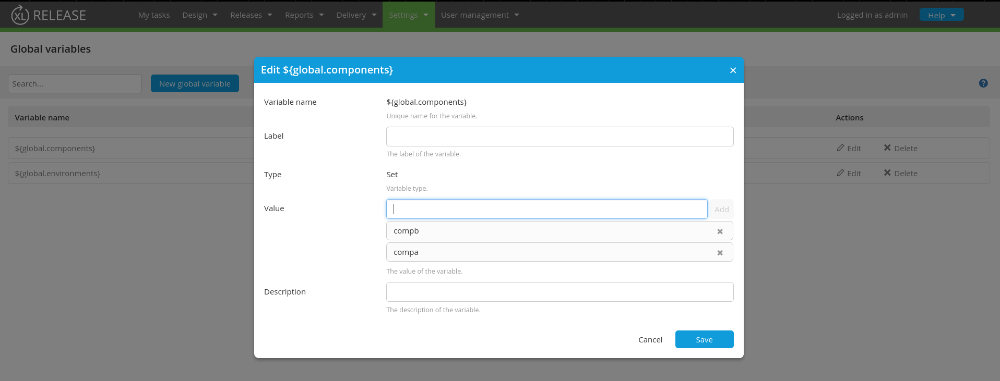
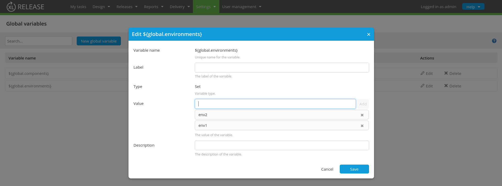
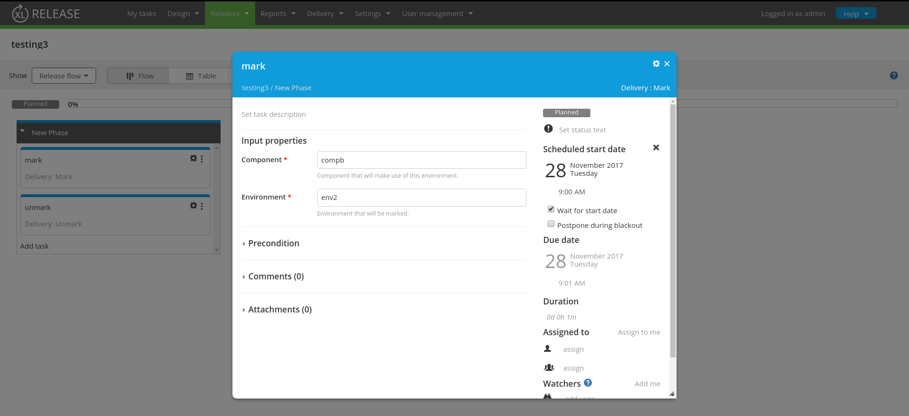
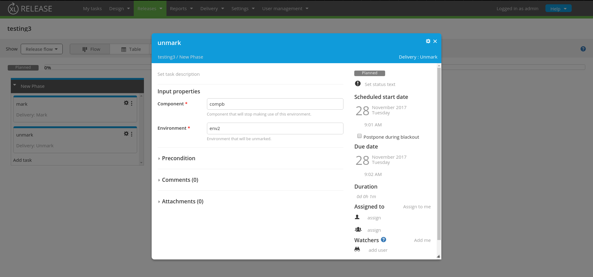
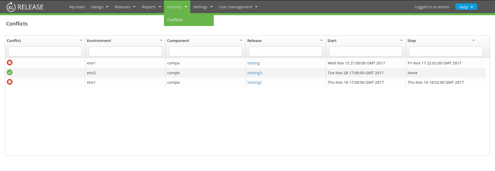

# XL Release Delivery Plugin

[](https://opensource.org/licenses/MIT)

## Overview

XL Release offers outstanding capabilities for pipeline composition and execution. This plugin extends those capabilities
with the ability to define components and environments.

Components can be Features, User Stories, PBI's, etc.
Environments typically correspond with logical environments like QA1, TST, PROD.

The plugin offers visualization on what component will use which environment when and visualizes conflicts.
  
## Features

* Ability to `mark` and `unmark` the usage of an environment by a Component.
* Ability to maintain a set of components using a global variable.
* Ability to maintain a set of environments using a global variable
* Ability to visualize any conflicts.

### Define Components


### Define Environments


### Mark an Environment


### Unmark an Environment


### Visualize Conflicts


## Requirements

* **XL Release Server** 7+
		

## Installation


Plugin can be downloaded directly from the plugin's repository on [Github](https://github.com/jdewinne/xlr-delivery-plugin/releases).

* `Version less than 8.0` Place the plugin's **jar** file in the __&lt;xlr-home&gt;/plugins__ directory. 
* `8.0 and Higher` Place the plugin's **jar** file in the __&lt;xlr-home&gt;/plugins/&lowbar;&lowbar;local&lowbar;&lowbar;__ directory.

## Usage ##

The plugin will analyse all **`delivery.Mark`** and **`delivery.Unmark`** tasks in the current release/template and its targets to build up the potential conflicts.
As such, when adding those Tasks inside Releases, the delivery conflict analyzer will use the `Start Date` of the `delivery.Mark` tasks and the `End Date` of the `delivery.Unmark` task to analyze conflicts.

Conflicts can be viewed from the top level menu item `Delivery > Conflicts`.


## Development

This plugin is built using Node.js, Webpack and Gradle.
Execute `./gradlew clean build` in the project root to build.

### Setup development XL Release Server ###

You can setup your local development XL Release Server to point to the compiled build by modifying the classpath variable, `XL_RELEASE_SERVER_CLASSPATH`, in `<xlr-home>/bin/run.sh` 

Example :

```
DEV_HOME="/Users/jdewinne/labs/repos/jdewinne/xlr-delivery-plugin"
DEV_SERVER_CLASSPATH="${DEV_HOME}/build/app:${DEV_HOME}/src/main/resources/:${DEV_HOME}/src/main/jython/"
XL_RELEASE_SERVER_CLASSPATH="${DEV_SERVER_CLASSPATH}:${classpath_dirs}"

#XL_RELEASE_SERVER_CLASSPATH="${classpath_dirs}"
```

### Live Update ###

Once you've started the development XLR server, you can execute `npm run watch` in the project root.  Now everytime you edit the source, it will be automatically compiled and your browser automatically refreshed to reflect the changes.

